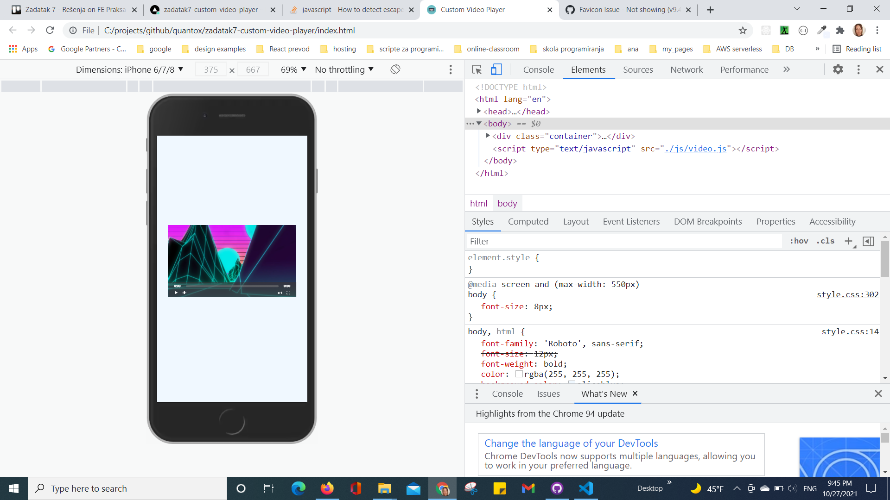
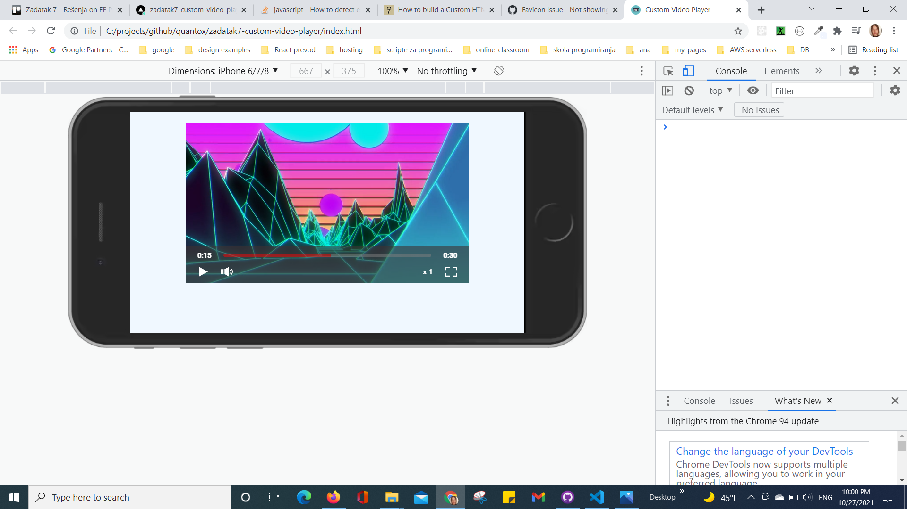

# Tatjana Marković Custom Video Player
## Table of contents

  - [Overview](#overview)
  - [The challenge](#the-challenge)
  - [Screenshot](#screenshot)
  - [Links](#links)
  - [My process](#my-process)
  - [Built with](#built-with)
  - [Author](#author)

## Overview

- On first load
  1. Show Initial Values 100K pageviews / $16 per month

- App behavior
  By positioning the slider, the user gets a monthly price depending on the page views. For annual subscription, discount is 25%
Here are the different page view ranges and the corresponding monthly price totals:

- 10K pageviews / $8 per month
- 50K pageviews / $12 per month
- 100K pageviews / $16 per month
- 500k pageviews / $24 per month
- 1M pageviews / $36 per month

If the visitor switches the toggle to yearly billing, a 25% discount should be applied to all prices.
## The challenge

Your challenge is to build out this interactive pricing component and get it looking as close to the design as possible.

Your users should be able to:

- View the optimal layout for the app depending on their device's screen size
- See hover states for all interactive elements on the page
- Use the slider and toggle to see prices for different page view numbers (details provided below)

### Screenshot

### Links

- Solution URL: [GitHub](https://github.com/tatjama/bonus-zadatak6-slider-component/tree/develop)
- Preview: [Vercel](https://bonus-zadatak6-slider-component-20rsxdh32-tatjana.vercel.app/)
- Live Site URL: [Vercel](https://bonus-zadatak6-slider-component.vercel.app/)

## My process

1. Create a new project
2. Import starting code
3. Initializing git repositories main and develop
4. Import git repositories to the Vercel project
5. Create HTML structure
6. Create CSS Utility
7. Style for Desktop
8. Responsive Mobile
9. Create JavaScript Behavior for Pages
11. Manual Test for bugs
14. Compare original designs with my work
15. Create screenshots
16. Change README-template.md to README.md
17. Open Pull request
18. Solve Issue
19. Merge develop branch into master branch
### Built with

1. Semantic HTML5 markup
2. CSS custom properties
- FlexBox
- Media queries
- Centering elements, content and text
- Element positioning
- Customize font,width and size
- Hover
- CSS variables
- gradient
3. JavaScript
- DOM manipulation   
- Event handling
## Author

- Website - [Tatjana Markovic](https://my-react-portfolio-tatjana.vercel.app/)
- LinkedIn - [Tatjana Marković](https://www.linkedin.com/in/tatjana-markovi%C4%87-919501189/)
- GitHub - [tatjama](https://github.com/tatjama)